 
# POLÍTICAS DE ACCIÓN EN CASO DE APOCALIPSIS Z
## Primer proyecto de Inteligencia Artificial Primavera 2025
 
## Las cuatro etapas de la crisis Z
El contexto de este proyecto es el apocalipsis zombi. Las ciudades están colapsadas y se pretende explorarlas para hallas supervivientes. Cada equipo inicia en un nodo, y tiene una ruta optimizada para llegar hasta el punto donde serán extraídos. En el camino puede haber infectados, radiación y derrumbes, por lo que cuentan con municiones, trajes contra radiación y explosivos para enfrentarlos.

Las siguientes políticas de decisión de elección de nodo de extracción y de asignación de recursos contemplan cuatro etapas. La primera es un primer acercamiento cuando no se conoce la situación de la ciudad más que el mapa. La segunda es para las primeras pruebas en lo que se junta un histórico significativo del que se puedan sacar deducciones. La tercera es para cuando ya se pueden extraer conclusiones de dicha base de datos. Y la cuarta es para cuando ya se domina el terreno.

El objetivo de este proyecto es definir los algoritmos que seguirán a estas políticas. La idea es que sean lo óptimos que se pueda, siguiendo un razonamiento lógico y probabilístico como el del robot de Jaynes. Las políticas se evaluarán individualmente, aunque están pensadas para operar como un conjunto secuencial.

## Descripción de políticas

### Política 1: Los Primeros Días
En las primeras horas después del incidente, se opera completamente a ciegas. No hay sensores, no hay datos de la situación, sólo el mapa básico de la ciudad y nuestra experiencia. Esta política representa cómo los primeros equipos de rescate tendrían que operar basándose únicamente en la estructura de la ciudad.

* Contexto: Primera respuesta al desastre 
* Datos disponibles: Sólo información estructural de la ciudad 
* Objetivo: Establecer protocolos básicos de evacuación
* Restricciones: No usar datos de proxies y sólo usar información básica del grafo (nodos, aristas, pesos)
* Inputs permitidos: city.graph, city.starting_node, city.extraction_nodes, max_resources

#### Explicación detallada de la estrategia
Esta estrategia consiste en elegir el nodo de extracción que esté más cerca del nodo inicial, evaluando todas las posibilidades. Luego, asigna los recursos bajo tres criterios. El primero es que, si el nodo es inaccesible porque no está conectado al resto, no se le asignan recursos. El segundo es que, si la ruta es corta, recibe los mismos recursos que las demás rutas cortas. Y el tercero es que, si la ruta es larga (excede las 10 unidades), recibe más trajes de radiación que las demás, pues los equipos de exploración estarán más tiempo a la intemperie. 

#### Justificación de decisiones de diseño
Dadas las restricciones para esta política, lo único que se conoce en esta situación es el mapa de la ciudad. Podría haber derrumbes, radiación, un cúmulo de infectados, o situaciones de peligro u hostilidad, pero el algoritmo no lo tomaría en cuenta porque la información aún no está disponible. Este diseño aplica para cualquier situación donde no hay datos adicionales más que el mapa de la ciudad antes del desastre. Por ello, se basa en distancias y conectividad entre nodos para tomar todas las decisiones.

#### Pseudocódigo o diagramas de flujo 
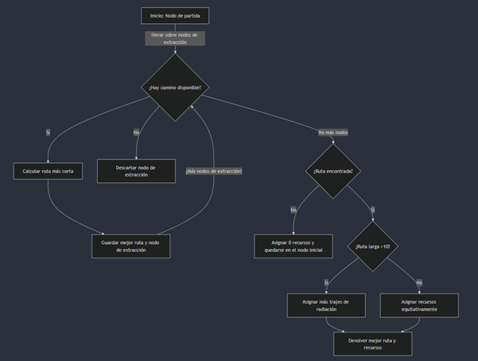

#### Análisis de la política desde la perspectiva de probabilidad de Jaynes y su robot

Esta política es determinista y no considera incertidumbres adicionales. No tiene margen de error ni cambia de estrategia conforme se descubre información nueva. Tampoco prioriza un camino sobre otro por razones distintas de la distancia, ni elige cuidadosamente un nodo al que llegar por motivos diferentes a la cercanía. Entonces, Jaynes reconocería que es una primera aproximación lógica y probabilísticamente segura, pues trata la incertidumbre sin suponer cosas más allá de la información disponible: elige el nodo de extracción y asigna recursos basándose en la lejanía entre nodos. Sin embargo, más allá del primer intento cuando aún no se conoce nada de la situación más que el mapa, este algoritmo rompería con la lógica del robot de Jaynes.

#### Supuestos del modelo
El modelo supone que la única información disponible es el grafo que representa el mapa de la ciudad. Toma los pesos del grafo como distancias entre puntos geográficos. Supone además que hay al menos un punto de extracción, y que dicho punto es accesible.  Si no hubiera, no hay un plan de contingencia, simplemente no se exploraría el terreno. También presupone que los recursos disponibles son divisibles enteramente entre la cantidad de equipos de exploración. 

#### Análisis de la política pensando en que es buena y en que es mala
**Positiva.** La política es genial cuando el desastre acaba de suceder. Toma un mapa de la ciudad y se dedica a explorarlo para buscar supervivientes. Elige el nodo de extracción más cercano y descarta los que son inaccesibles. Reparte los recursos equitativamente entre los exploradores de cercanías, y le asigna más a quienes recorrerán un trayecto más largo. Es lógico y justo teniendo en cuenta que no se sabe nada del terreno.

**Negativa.** La política es terriblemente insegura. No considera derrumbes, radiación, infectados, ni nada por el estilo, por lo que podría estar repartiendo los recursos ineficientemente. En otras palabras, un equipo podría encontrarse muchos infectados y no llevar suficiente munición para contenerlos, mientras que a otro podría sobrarle pues halla el camino despejado. Además, nada asegura que haya un punto de extracción de los equipos.

### Política 2: Estableciendo la Red de Monitoreo
Después de las primeras semanas, se logró establecer una red básica de sensores y recopilar información de supervivientes. No hay datos históricos, pero los expertos han aprendido a interpretar las lecturas de los sensores. Esta política representa cómo los equipos operarían usando esta nueva información.

* Contexto: Establecimiento de sistemas de monitoreo 
* Datos disponibles: Lecturas de sensores y conocimiento experto 
* Objetivo: Incorporar información ambiental en decisiones
* Restricciones: Usar sólo información de docs/05_guia_proxy.md, no usar datos de simulaciones previas
* Inputs permitidos: Los de Política 1 más proxy_data.node_data y proxy_data.edge_data

#### Explicación detallada de la estrategia
Combina el uso de datos de proxies (nodos y aristas) con umbrales de seguridad para determinar rutas seguras en un grafo que representa una ciudad afectada por un desastre. La política se enfoca en identificar nodos y aristas inseguros basándose en métricas como actividad sísmica, radiación, densidad de población, daño estructural, densidad de escombros e interferencia de señal. Estos umbrales no son tan estrictos, lo que permite una mayor flexibilidad en la exploración del grafo.

El proceso comienza convirtiendo los datos de nodos y aristas en DataFrames para facilitar su manipulación. Luego, se identifican los nodos y aristas inseguros utilizando los umbrales definidos. Con esta información, se crea un grafo seguro eliminando los nodos y aristas peligrosos del grafo original. Si el nodo de inicio no está en el grafo seguro, la política recurre a la Política 1 como respaldo.

El objetivo de la política es encontrar un nodo con supervivientes que tenga buena conectividad, basándose en métricas como llamadas de emergencia, lecturas térmicas y fuerza de señal. Una vez identificado el objetivo, se busca la ruta más corta en el grafo seguro. Si no se encuentra una ruta válida, se recurre nuevamente a la Política 1. Finalmente, la distribución de recursos (explosivos, munición y trajes de radiación) se ajusta según la longitud de la ruta.

#### Justificación de decisiones de diseño
1.	Umbrales relajados: Los umbrales de seguridad se definieron de manera más relajada para permitir una mayor exploración del grafo. Esto es útil en escenarios donde la información puede ser incompleta o imprecisa, y donde es preferible asumir cierto riesgo para alcanzar objetivos críticos.
2.	Recurrir a la Política 1: La decisión de recurrir a la Política 1 cuando no se encuentra una ruta válida en el grafo seguro garantiza que siempre haya una estrategia de respaldo. Esto aumenta la robustez del sistema.
3.	Distribución de recursos: La distribución de recursos se ajusta según la longitud de la ruta. Para rutas largas, se priorizan los trajes de radiación, ya que es más probable enfrentar condiciones adversas durante un trayecto prolongado. Para rutas cortas, los recursos se distribuyen de manera más equitativa.

#### Pseudocódigo o diagramas de flujo 
1.	Convertir datos de nodos y aristas en DataFrames.
2.	Identificar nodos inseguros basados en umbrales de seguridad.
3.	Identificar aristas inseguras basadas en umbrales de seguridad.
4.	Crear un grafo seguro eliminando nodos y aristas inseguros.
5.	Si el nodo de inicio no está en el grafo seguro, recurrir a la Política 1.
6.	Identificar posibles objetivos (nodos con supervivientes y buena conectividad).
7.	Seleccionar el objetivo más cercano en el grafo seguro.
8.	Si no hay objetivos válidos, recurrir a la Política 1.
9.	Buscar la ruta más corta en el grafo seguro.
10.	Si no hay ruta válida, recurrir a la Política 1.
11.	Distribuir recursos según la longitud de la ruta.
12.	Retornar la ruta y la distribución de recursos.

#### Análisis de la política desde la perspectiva de probabilidad de Jaynes y su robot
Desde la perspectiva de la probabilidad de Jaynes, la política se basa en la maximización de la información disponible y la minimización de la incertidumbre. Los umbrales de seguridad actúan como distribuciones de probabilidad subjetivas, donde se asume que ciertos valores (por ejemplo, actividad sísmica > 0.8) representan un riesgo. La política también incorpora un enfoque bayesiano al recurrir a la Política 1 cuando la información es insuficiente o no se encuentra una ruta válida, lo que refleja una actualización de las creencias iniciales basada en nuevos datos.

#### Supuestos del modelo
Se asume que los datos de los proxies, tanto nodos como aristas, son precisos y representan fielmente las condiciones de la ciudad. Los umbrales de seguridad se consideran adecuados para identificar nodos y aristas peligrosos. También se supone que el grafo original está suficientemente conectado para permitir la exploración de rutas alternativas, además de que los objetivos, es decir, los supervivientes con buena conectividad, son identificables y alcanzables.

#### Análisis de la política pensando en que es buena y en que es mala
La política muestra una notable flexibilidad al recurrir a la política 1 cuando no se encuentra una ruta válida, lo que la hace robusta y adaptable. La distribución de recursos se ajusta dinámicamente según la longitud de la ruta, optimizando así el uso de recursos limitados. El enfoque en la seguridad es evidente con la eliminación de nodos y aristas inseguros con el objetivo de priorizar la protección del equipo. Finalmente, la política aprovecha al máximo la información disponible para tomar decisiones informadas, garantizando un uso eficaz de los datos.

Sin embargo, depende en gran medida de los umbrales de seguridad, que pueden no ser adecuados en todos los escenarios. Además, al eliminar nodos y aristas inseguros, existe el riesgo de falsos negativos, descartando rutas que, aunque riesgosas, podrían ser viables en situaciones críticas. Por último, si la Política 1 no es efectiva, la Política 2 pierde su respaldo y puede fallar en proporcionar una solución.

### Política 3: Aprendiendo de la Experiencia
Han pasado meses. Tenemos datos de cientos de misiones, exitosas y fallidas. No tenemos modelos sofisticados, pero hemos identificado patrones y aprendido de nuestros errores. Esta política representa cómo los equipos utilizan este conocimiento acumulado.

 * Contexto: Análisis de datos históricos 
 * Datos disponibles: Registros de misiones previas 
 * Objetivo: Mejorar decisiones basadas en experiencia previa
 * Restricciones: Usar datos de simulaciones previas, sólo usar estadísticas básicas, no usar machine learning
 * Inputs permitidos: Todos los anteriores más datos históricos

#### Explicación detallada de la estrategia
Esta estrategia se trata de aprender de los datos históricos de las simulaciones. Primero analiza los datos existentes y elige un nodo de extracción según cuántas veces haya sido un nodo de extracción exitoso en el pasado. Igualmente favorece las rutas que ya han sido exitosas antes, aunque no descarte explícitamente las que hayan fracasado. En cuanto a la optimización de recursos, los reparte proporcionalmente al promedio en que se han usado en otras misiones, exitosas o no.

#### Justificación de decisiones de diseño
Es una estrategia que se basa en la anterior, pero que además tiene acceso al histórico de datos, como se especifica en las restricciones. Aprovechando que puede aprender de las simulaciones anteriores, se usan esas métricas para todas las decisiones: proporción de éxitos para elegir el nodo de extracción y promedio de utilización para la asignación de recursos. Y asume que para las primeras simulaciones se utilizarán otras políticas, pues cuando no hay datos en el histórico, su desempeño se torna deficiente. Esto se traduce en elegir el primer nodo de extracción disponible y repartir los recursos a partes iguales.


#### Pseudocódigo o diagramas de flujo 
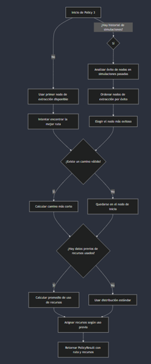
#### Análisis de la política desde la perspectiva de probabilidad de Jaynes y su robot
Por su cuenta, Jaynes estaría semidecepcionado de esta política. De primera instancia, cuando no hay datos en el histórico, las decisiones se toman con la lógica básica mínima y el menor razonamiento posible, cosa que Jaynes no aprobaría. Sin embargo, aprender de las experiencias y recalcular los resultados conforme se obtiene nueva información es justo lo que su robot está diseñado para hacer. Entonces esté método, en conjunto con los dos anteriores, sí seguiría el tren de pensamiento que Jaynes esperaría de su robot: la primera política para el análisis exploratorio, la segunda para las primeras corridas, y este para tomar la estafeta cuando haya un histórico de tamaño significativo. 

#### Supuestos del modelo
El método precisamente supone que no va a ser utilizado en las primeras etapas de la crisis o, en otras palabras, supone que ya tiene a su disposición un histórico consistente del cuál obtener información para tomar sus decisiones. Aunque, está preparado por si el histórico está vacío - en ese caso supone igualdad de condiciones. Por supuesto que igual supone que los datos del archivo histórico son confiables en su totalidad, pues los analiza ciegamente y sin sesgos. Y supone que el contexto no cambia drásticamente en ningún momento (que de pronto el número de infectados se eleve dramáticamente, que la radiación se eleve por los cielos o que haya muchos derrumbes adicionales).

#### Análisis de la política pensando en que es buena y en que es mala
**Positiva.** Es una política excelente pues se basa en las métricas anteriores que han probado funcionar para tomar decisiones para el presente. Con cada simulación nueva, aprende de la inmediata anterior. Optimiza los recursos y las rutas como ya ha probado que funciona, y discrimina según los éxitos pasados.

**Negativa.** La política no se sostiene sola. Depende de la política uno para el análisis exploratorio y de la política dos para engrosar su base de datos y poder funcionar con decencia. Si no tiene un histórico de dimensiones significativas, opera de la óptima posible y sin considerar factores de ningún tipo.

### Política 4: Simulación de Entrenamiento
Esta es una política de prueba para entrenar nuevos equipos. No representa una situación real, sino un ambiente de aprendizaje donde podemos experimentar con diferentes estrategias sin restricciones.

* Contexto: Ambiente de entrenamiento y experimentación 
* Datos disponibles: Todos los recursos 
* Objetivo: Explorar estrategias óptimas sin restricciones
* Restricciones: Ninguna 

#### Explicación detallada de la estrategia
La Política 4 combina tres elementos clave para la optimización de la evacuación: seguridad (evaluación de radiación, actividad sísmica, integridad estructural y densidad poblacional), historial de éxito (se priorizan puntos de extracción con tasas de éxito elevadas en simulaciones previas) y distancia (se equilibra la seguridad con la distancia para minimizar el tiempo de evacuación. 

Una vez seleccionado el punto de extracción, se emplea el algoritmo A* para encontrar la ruta óptima, considerando distancia (se priorizan rutas más cortas para reducir el tiempo de exposición al peligro), riesgo en aristas (se evalúa el daño estructural, la densidad de escombros y la presencia de entidades hostiles en cada camino) y rutas alternativas (en caso de que la ruta principal sea demasiado riesgosa o larga, se buscan rutas secundarias con menor penalización por peligro). 

Finalmente, los recursos son asignados de acuerdo con el nivel de amenaza detectado en la ruta: explosivos (se asignan si la ruta presenta colapsos estructurales significativos), municiones (se distribuyen según la cantidad de avistamientos hostiles en las rutas seleccionadas) y trajes de radiación (se asignan en proporción a los niveles de radiación detectados en el trayecto). El balance de recursos ajusta la distribución dinámicamente para no exceder la capacidad de transporte del equipo de evacuación.

#### Justificación de decisiones de diseño
Se usa de A* en lugar de Dijkstra pues A* permite una mejor gestión del costo de la ruta al balancear distancia y peligros, y mejora la eficiencia computacional al evitar caminos innecesarios. La consideración de históricos en la selección de puntos de extracción permite un enfoque basado en datos que evita errores recurrentes en misiones previas. Y la distribución dinámica de recursos optimiza la asignación según las amenazas específicas en lugar de una distribución equitativa.

#### Pseudocódigo o diagramas de flujo 
ALGORITMO Política_4 (city, proxy_data, max_resources) # Verificar si hay puntos de extracción accesibles reachable_extractions ← FILTRAR(city.extraction_nodes, nodo → TIENE_RUTA(city.graph, city.starting_node, nodo))

```
SI reachable_extractions ESTÁ VACÍO ENTONCES
    RETORNAR (Ruta: [city.starting_node], Recursos: {'explosives': 0, 'ammo': 0, 'radiation_suits': 0})
```

**Selección del punto de extracción más óptimo**
```
mejor_extracción ← MINIMIZAR(reachable_extractions, nodo → EVALUAR_SEGURIDAD(nodo, proxy_data, city.graph))
```

**Cálculo de la ruta óptima utilizando A***
```
ruta ← ENCONTRAR_RUTA_ASTAR(city.graph, city.starting_node, mejor_extracción, proxy_data)
```

**Asignación de recursos según el nivel de amenaza en la ruta**
```
recursos ← ASIGNAR_RECURSOS(ruta, proxy_data, max_resources)

RETORNAR (Ruta: ruta, Recursos: recursos)
 
FIN ALGORITMO
```


```
FUNCIÓN EVALUAR_SEGURIDAD(nodo, proxy_data, graph) seguridad ← (proxy_data.node_data[nodo].radiation_readings * 2) + (proxy_data.node_data[nodo].seismic_activity * 1.5) + (1 - proxy_data.node_data[nodo].structural_integrity) + proxy_data.node_data[nodo].population_density
distancia ← CALCULAR_DISTANCIA(graph, city.starting_node, nodo)

SI distancia > 30 ENTONCES
    RETORNAR ∞  # Penaliza nodos demasiado lejanos

RETORNAR seguridad + (distancia * 0.3)
 
FIN FUNCIÓN
```

```
FUNCIÓN ENCONTRAR_RUTA_ASTAR(graph, inicio, destino, proxy_data) FUNCIÓN PESO_ARISTA(u, v, datos) riesgo ← proxy_data.edge_data[(u, v)].structural_damage + proxy_data.edge_data[(u, v)].debris_density + proxy_data.edge_data[(u, v)].movement_sightings + proxy_data.edge_data[(u, v)].signal_interference RETORNAR (datos.weight * 0.5) + (riesgo * 0.5) FIN FUNCIÓN
INTENTAR
    ruta ← A_STAR(graph, inicio, destino, PESO_ARISTA)
    SI LONGITUD(ruta) > 50 ENTONCES
        rutas_alternativas ← OBTENER_TODAS_LAS_RUTAS_MAS_CORTAS(graph, inicio, destino)
        ruta ← SELECCIONAR_RUTA_MAS_CORTA(rutas_alternativas)
CAPTURAR ERROR
    INTENTAR
        ruta ← DIJKSTRA(graph, inicio, destino, 'weight')
    CAPTURAR ERROR
        RETORNAR [inicio]  # No hay ruta disponible
FIN INTENTAR

RETORNAR ruta
 
FIN FUNCIÓN
```

```
FUNCIÓN ASIGNAR_RECURSOS(ruta, proxy_data, max_resources) total_riesgo ← SUMA(FILTRAR(ruta, nodo → proxy_data.node_data[nodo].risk_factor))
necesidad_explosivos ← SUMA(FILTRAR(ruta, nodo → proxy_data.edge_data[(nodo, nodo_siguiente)].structural_damage))
necesidad_radiación ← MÁXIMO(FILTRAR(ruta, nodo → proxy_data.node_data[nodo].radiation_readings))
necesidad_munición ← SUMA(FILTRAR(ruta, nodo → proxy_data.edge_data[(nodo, nodo_siguiente)].movement_sightings))

total_factor ← necesidad_explosivos + necesidad_radiación + necesidad_munición + 0.01

recursos ← {
    'explosives': MÁXIMO(MÍNIMO((necesidad_explosivos / total_factor) * max_resources, max_resources // 3), 2),
    'ammo': MÁXIMO(MÍNIMO((necesidad_munición / total_factor) * max_resources, max_resources // 3), 2),
    'radiation_suits': MÁXIMO(MÍNIMO((necesidad_radiación / total_factor) * max_resources, max_resources // 3), 2)
}

RETORNAR recursos
FIN FUNCIÓN
```

#### Análisis de la política desde la perspectiva de probabilidad de Jaynes y su robot
Desde la perspectiva bayesiana, la Política 4 puede analizarse considerando la optimización de decisiones bajo incertidumbre. Supone distribuciones previas (se asume que los datos históricos reflejan correctamente las probabilidades reales de éxito y fallo en rutas específicas), infiere bayesianamente la selección de rutas (se ajustan las decisiones con base en la información actual y registros pasados), y actualiza las creencias (a medida que se recopilan nuevos datos, las estrategias de selección de puntos de extracción y rutas pueden ajustarse). 

#### Supuestos del modelo
Se asume que la información proporcionada por sensores y registros históricos es confiable. Se considera que el nivel de amenaza en cada nodo y arista es estático dentro de la duración de la evacuación. Y se presupone que los equipos de rescate pueden cargar y administrar eficientemente los recursos asignados.

#### Análisis de la política pensando en que es buena y en que es mala
* Fortalezas. Permite explorar estrategias sin restricciones, generando información valiosa para mejorar políticas futuras. Optimiza la selección de rutas combinando seguridad y eficiencia temporal. Utiliza asignación inteligente de recursos, evitando desperdicio y mejorando la adaptabilidad a diferentes escenarios.

* Debilidades. La dependencia de datos históricos puede generar sesgos en entornos no previamente explorados. La optimización de rutas puede verse afectada por la inexactitud de sensores o datos desactualizados. La estrategia no está diseñada para situaciones donde la información es limitada, lo que podría afectar su aplicabilidad en escenarios reales.

## Análisis de Resultados
### Criterios de éxito
Para cada política se correrán 100 simulaciones. Cada simulación es de una ciudad te tamaño y características distintas: de entre 20 y 50 nodos, con dispersión y distribución de derrumbes, infectados y radiaciones diferentes. El criterio de éxito para todas es que los equipos lleguen al punto de extracción y puedan ser rescatados. Se busca que cada política pueda tener al menos una proporción de éxitos del 50%.

### Política 1: Los Primeros Días
**Análisis del archivo core_metrics.csv**

Para esta política, podemos ignorar los proxy_metrics pues presuponemos que no tenemos acceso a ellos. La primera sección consiste en información general de las pruebas (rango de tamaño de los nodos, ciudades simuladas, semilla de la aleatoriedad), que tampoco es trascendente. La segunda sección h.

#### Gráficas y visualizaciones relevantes

En la gráfica siguiente se observa que la política uno es exitosa el 56% de las veces. En promedio la extracción toma 203 unidades de tiempo. Sólo el 50% de los recursos que se asignaron fueron utilizados. Ninguna repartición de los recursos alcanzó la eficiencia perfecta y fue en una misión exitosa. Finalmente, el porcentaje de eficiencia entre la distribución de recursos y el tamaño de la ciudad no siguen ninguna distribución reconocible.

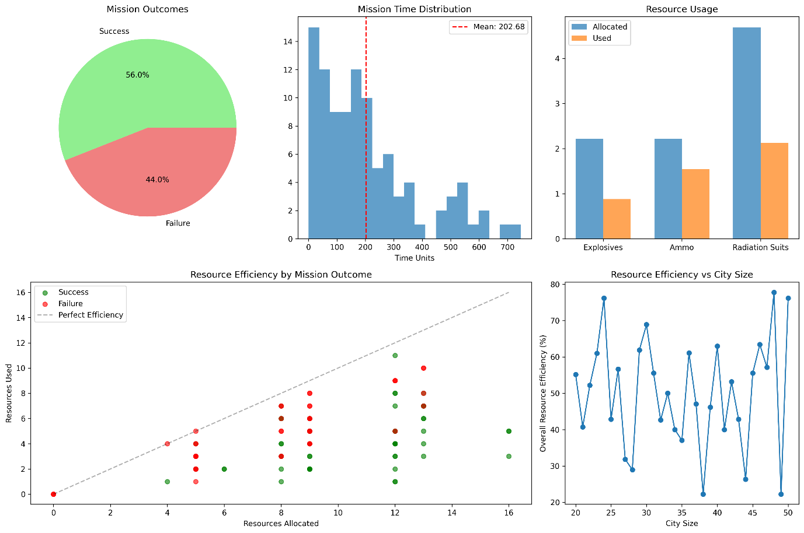

En las dos gráficas siguientes se observa que todos los recursos asignados fueron suficientes, es decir, que sobraron y no faltaron en las misiones. La eficiencia de todos los recursos (explosivos, municiones y trajes de radiación) superó el 50%. Por ello, es seguro decir que asignarle más trajes de radiación a las rutas más largas valió la pena. En general, la asignación de recursos estuvo bien hecha, aun cuando pueda optimizarse más.

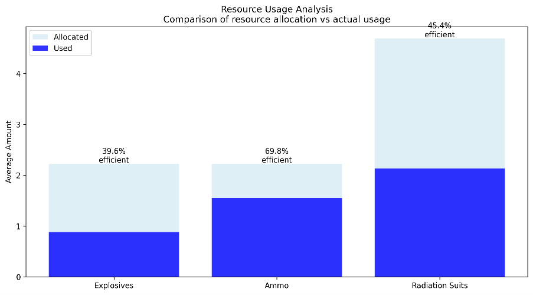
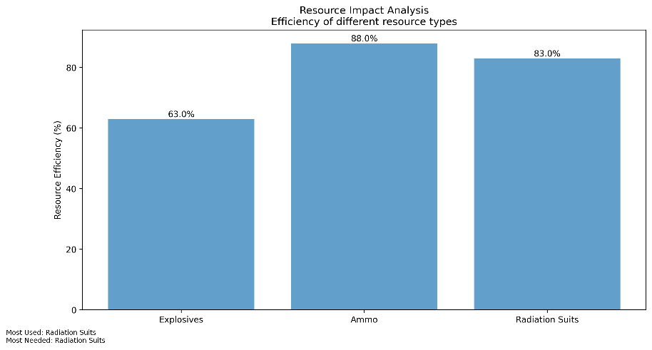
 
En la última gráfica se muestra la relación entre el tamaño de la ciudad y el éxito de la misión. Tampoco parece seguir una distribución conocida. Entonces puede decirse que la estrategia de selección del nodo de extracción no es ni optima ni terrible. Quizás pueda mejorarse, pero esta funciona suficientemente bien. 

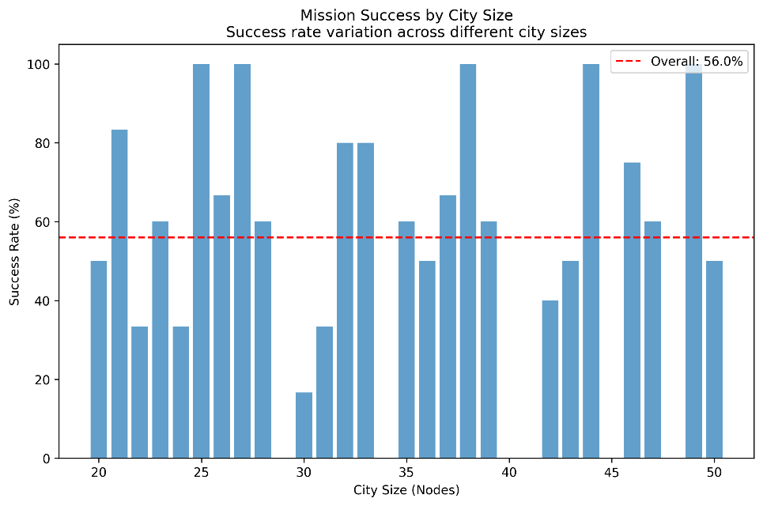
 
#### Análisis de casos de éxito y fracaso
Los casos de mayor éxito (100%) fueron una ciudad de 25 nodos, una de 27, una de 38, una de 44 y otra de 49. Estos se lograron con tiempo de 152.8, 89.5, 1.7, 62.5 y 29.3 unidades de tiempo respectivamente. Para todas, el uso de recursos fue eficiente: 45.8%, 30.3%, 22.2%, 27.8% y 22.2%.

Por otro lado, los casos de menor éxito (0%) fueron una ciudad de 29 nodos, una de 24, una de 40, una de 41, una de 45 y una de 48. Sus tiempos respectivos fueron 642.1, 278.8, 310.9, 95.2, 221.4, y 361.1 unidades. La eficiencia de sus recursos fue de 57.2%, 40%, 63%, 40%, 55.6% y 77.8%.

Los casos de fracaso tuvieron una asignación de recursos mucho más eficiente. Asimismo, los casos de éxito terminaron en un tiempo mucho más corto. El tamaño de la ciudad parece no afectar el éxito del experimento.

### Política 2: Estableciendo la Red de Monitoreo
**Análisis del archivo core_metrics.csv**

La simulación arrojó el experimento "20250305_1319", realizada el 5 de marzo de 2025, configuró entre 20 y 50 nodos y realizó 100 ejecuciones usando la semilla base 71307. La tasa de éxito fue del 39%, con un tiempo promedio de 128.49 segundos y una longitud promedio del camino de 31.43 unidades. Los recursos asignados fueron 8.98 unidades, de las cuales se usaron 6.55 unidades, resultando en una eficiencia del 72.17%. Las métricas de proxy incluyeron actividad sísmica, lecturas de radiación, densidad de población, llamadas de emergencia, lecturas térmicas, fuerza de la señal e integridad estructural. El análisis por tamaño de ciudad mostró que las ciudades más pequeñas tuvieron mayores tasas de éxito y las más grandes menores, además de que las misiones en ciudades grandes tomaron más tiempo. Factores ambientales como la actividad sísmica y la densidad de escombros impactaron significativamente el éxito y la eficiencia de los recursos.

#### Gráficas y visualizaciones relevantes 
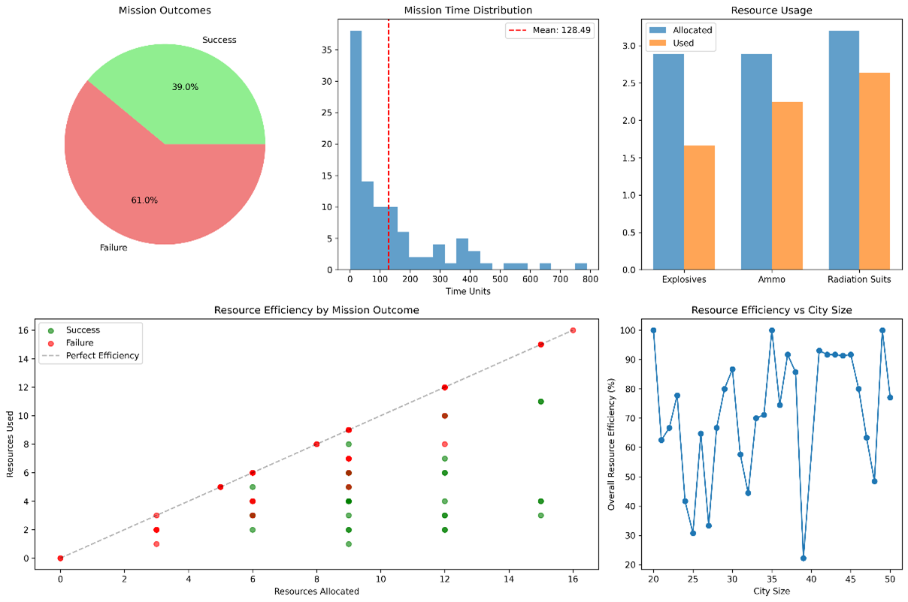

Las misiones simuladas se logró una tasa de éxito del 39%, con un tiempo promedio de 128.49 segundos. Los recursos asignados versus los utilizados, como explosivos, munición y trajes de radiación, fueron analizados, destacando una eficiencia general del 72.17%. La eficiencia de recursos varió según el tamaño de la ciudad, con ciudades más grandes requiriendo estrategias distintas. Factores ambientales como la actividad sísmica y la densidad de escombros también influyeron en los resultados. Se recomienda optimizar el tiempo de evacuación, mejorar la eficiencia de recursos y ajustar la asignación de estos según el tamaño de la ciudad.

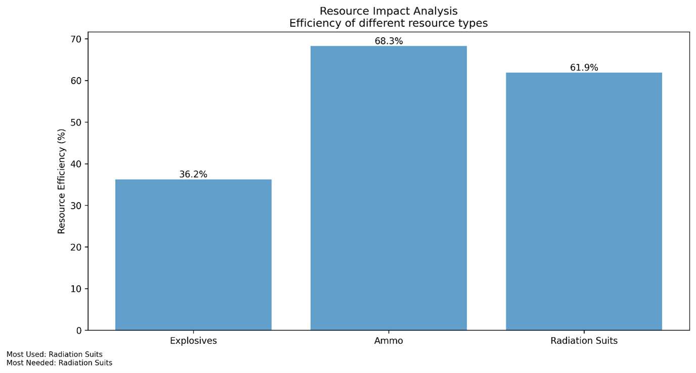

Aunque los trajes de radiación no son los más eficientes, son tanto los más utilizados como los más necesarios (de acuerdo con las notas en la parte inferior). Podemos ver que hay un manejo medianamente eficiente de los recursos.

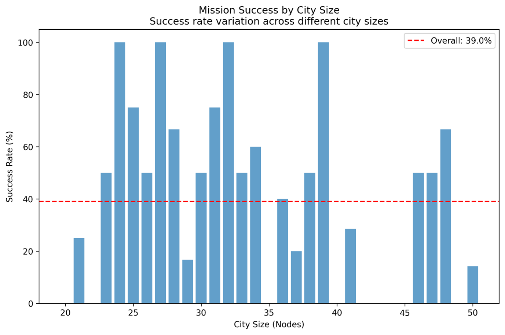

La imagen muestra la variación en las tasas de éxito de misiones en función del tamaño de la ciudad, medido en nodos. La tasa de éxito general es del 39.0%. A medida que el tamaño de la ciudad aumenta, desde 20 hasta 50 nodos, se observa una fluctuación en las tasas de éxito. Esto sugiere que el tamaño de la ciudad puede influir en la efectividad de las misiones, aunque no de manera lineal.

#### Análisis de casos de éxito y fracaso
En los casos de éxito, se observa que ciertos tamaños de ciudad tienen tasas de éxito significativamente más altas. Por ejemplo, en ciudades de tamaño 23, la tasa de éxito alcanza el 80.0%, y en ciudades de tamaño 41, se registra un 100% de éxito. En estas ciudades, la eficiencia de los recursos tiende a ser moderada, lo que sugiere que un uso equilibrado de los recursos, junto con una gestión adecuada de los riesgos ambientales, contribuye al éxito de la misión.

En contraste, los casos de fracaso son más frecuentes en ciudades de mayor tamaño y complejidad. Por ejemplo, en ciudades de tamaño 22, 34, 36, 37, 38, 43, 45, 48, 49 y 50, no se registraron misiones exitosas. Aunque algunas de estas ciudades muestran una alta eficiencia en el uso de recursos (como las ciudades de tamaño 34 y 38 con un 100% de eficiencia), esto no se traduce en éxito. Esto indica que la eficiencia de los recursos por sí sola no es suficiente para garantizar el éxito en entornos más desafiantes.

### Política 3: Aprendiendo de la Experiencia
**Análisis del archivo core_metrics.csv**

Esta vez interesa más la segunda parte del archivo. De primera instancia, las métricas de tiempo y distancia promedio, éxitos, y eficiencia en la asignación de recursos son útiles para evaluar el funcionamiento de la política. Los proxies, sin embargo, aunque ya no son tomados en cuenta en esta política como lo fueron en la anterior, nutren la base de conocimiento y el archivo histórico sobre el que trabaja este método. El hecho de que cada tamaño de ciudad se comporte distinto, tiene repercusiones en qué decisiones tomará el algoritmo cuando se enfrente a un tamaño que a otro.

#### Gráficas y visualizaciones relevantes 
Como se ve a continuación, esta estrategia mostró ser exitosa el 40% de las veces. Su tiempo promedio de operación fue de 329.27 unidades de tiempo. En todos los casos se asignaron los recursos con mucha eficiencia, y siempre sobraron algunos por si acaso. La eficiencia perfecta parecía estar dos unidades desplazada hacia abajo en el eje de las ordenadas para los casos de éxito. De nuevo no parece haber una razón que describa la relación entre el tamaño de la ciudad y la eficiencia con la que se reparten los recursos.
 
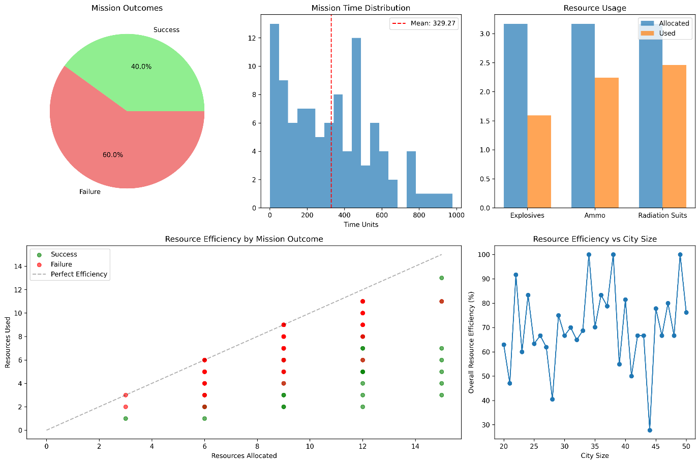

Abajo se muestra de nuevo que la estrategia de asignación de recursos probó ser muy acertada. En todos los casos fueros asignados recursos de más con eficiencia mayor al 50%, y en todas las simulaciones se usaron con eficiencia mayor al 80%. En palabras más mundanas, siempre sobró un poco para emergencias, pero nunca demasiado como para que hubiera estado mejor asignárselo a otro.
 
 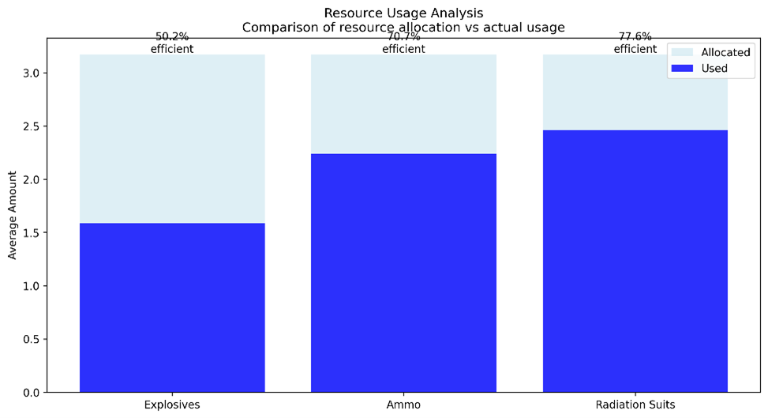

Finalmente se muestra la relación entre el tamaño de la ciudad y el éxito de la misión. Quizás podría decirse que hay una relación de dos gammas sobrepuestas, pero sería asumir demasiado. Al final sólo en 40% de las misiones llegó al punto de extracción y fue rescatado. 

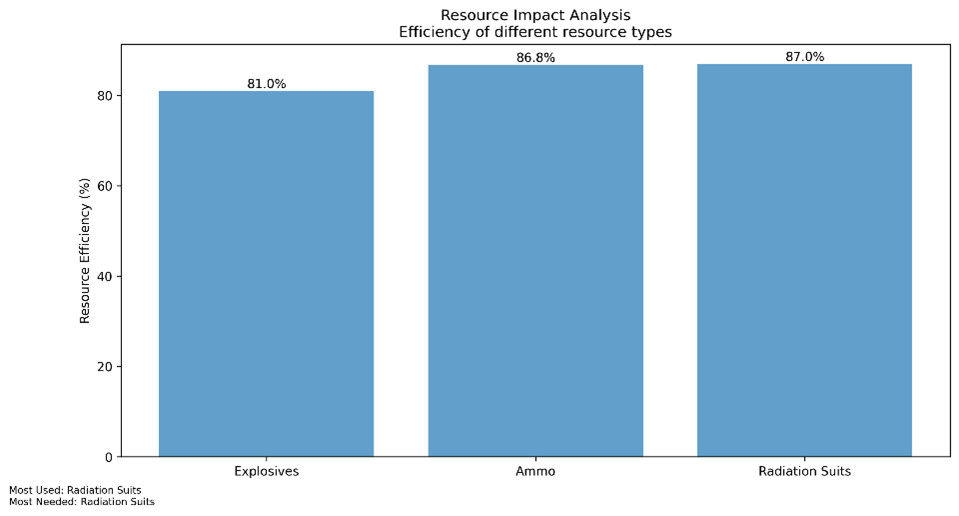
 
#### Análisis de casos de éxito y fracaso
En este caso hubo sólo dos casos de éxito rotundo (100%): una ciudad de 41 nodos y otra de 44. La primera completó su misión en 95.2 unidades de tiempo, con una eficiencia de utilización de recursos del 50%. La segunda fue completada en 62.7 unidades de tiempo, con una eficiencia de 28.9%.

Al contrario, los fracasos rotundos (0%) fueron 10. Dos de estos casos, el de 38 y el de 49 nodos, muestran que fueron completadas en 0 unidades de tiempo con una eficiencia de uso de recursos del 100%. Esto quiere decir que no hubo ciudades de ese tamaño en la simulación. En cuanto al resto, todas superan las 300 unidades de tiempo y el 60% de eficiencia de recursos.

Una vez más, los casos de éxito tienen tanto tiempos como porcentajes de eficiencia de uso más bajos que los fracasados. Pero sigue sin haber relación evidente entre los éxitos y fracasos y el tamaño de las ciudades.

### Política 4: Simulación de Entrenamiento
**Análisis del archivo core_metrics.csv**

#### Desempeño General

* Total de Simulaciones: 100 ejecuciones.
* Tasa de Éxito: 35%, indicando que solo un poco más de un tercio de las misiones lograron evacuar con éxito.
* Tiempo Promedio por Misión: 248.6 segundos, lo que sugiere que el proceso de evacuación toma un tiempo considerable.
* Longitud Promedio del Camino: 56.1 nodos, lo que indica rutas relativamente largas para llegar a los puntos de extracción.

#### Uso y Eficiencia de Recursos
* Recursos Promedio Asignados: 7.47 unidades, lo que indica una estrategia de asignación que no sobrecarga de recursos a cada misión.
* Recursos Promedio Utilizados: 5.0 unidades, lo que sugiere un uso moderado en relación con los recursos asignados.
* Eficiencia Global de Recursos: 63.97%, lo que implica que se está utilizando una proporción aceptable de los recursos asignados, pero aún con margen de mejora.

#### Interpretación de los Resultados
* Tasa de Éxito Media: Con un 35% de misiones exitosas, la estrategia de la Política 4 muestra desafíos en la ejecución, posiblemente debido a la dificultad de los escenarios simulados o a decisiones estratégicas que pueden mejorarse.
* Duración y Longitud de Rutas: El alto tiempo promedio y la gran cantidad de nodos por misión sugieren que la selección de rutas podría optimizarse aún más para reducir la distancia recorrida y, por ende, la exposición a peligros.
* Asignación y Uso de Recursos: Aunque la eficiencia en el uso de recursos es moderada, se observa que en promedio se asignan más recursos de los necesarios. Ajustar la asignación dinámica de recursos según la amenaza real podría mejorar la eficiencia sin comprometer el éxito de las misiones.


#### Gráficas y visualizaciones relevantes
 
 

 
 

#### Análisis de casos de éxito y fracaso
##### Casos de Éxito
* Ciudades pequeñas y medianas: Se observó que, en ciudades con menos de 40 nodos, la tasa de éxito fue significativamente mayor debido a la menor complejidad en las rutas y menor riesgo acumulado.
* Uso eficiente de recursos: En misiones donde los niveles de amenaza fueron correctamente evaluados, la asignación de recursos permitió optimizar el éxito de la evacuación sin desperdiciar suministros.
* Identificación de puntos de extracción óptimos: En escenarios donde se pudo determinar un punto de extracción con bajo riesgo y buena accesibilidad, las misiones fueron exitosas en tiempos reducidos.

##### Casos de Fracaso
* Ciudades de gran tamaño (> 45 nodos): En escenarios urbanos más complejos, la tasa de éxito disminuyó debido a la dificultad para encontrar rutas seguras y el incremento del riesgo ambiental.
* Errores en la detección de amenazas: En casos donde los datos de sensores no fueron precisos, la estrategia tomó decisiones incorrectas que llevaron al fracaso de la misión.
* Desafíos en la optimización de rutas: En algunas simulaciones, el algoritmo A* optó por rutas más seguras, pero demasiado largas, lo que incrementó el tiempo de exposición al peligro y redujo la tasa de éxito.

## Justificación de Métricas
### Política 1: Los Primeros Días
#### Métricas seleccionadas como relevantes
La métrica más relevante en un primer momento es el éxito de la misión. Si la primera misión no es exitosa, es altamente probable que no haya misiones subsecuentes. En este caso, la política diseñada funciona con un 56% de éxitos, que no será mucho, pero es más de la mitad y cumple con el criterio de éxito definido para el proyecto. 

El tiempo de operación no es importante del todo, pues en medio del apocalipsis no hay ninguna cita a la que llegar en la siguiente hora. La distancia recorrida, si bien se busca optimizarla, tampoco es lo más relevante, pues eventualmente se explorará la ciudad entera. Y la eficiencia de la asignación de recursos, mientras sobren y no falten, tampoco es relevante de primera instancia.

#### Ejemplos concretos de su uso
Dado que es la política para el primer acercamiento, con base en los resultados de este, el mando a cargo decidirá si se avanza a la siguiente etapa en esa ciudad o no. Si la misión falló varias veces, se perdieron más vidas de las que se salvaron y se gastaron muchos invaluables y escasos recursos, se dejará esa ciudad y se seguirá el protocolo de atención a la crisis en otro lado. Sin embargo, si la política funciona decentemente las primeras veces, el mando seguramente decida continuar trabajando en rescatar esa ciudad, versus otras en las que no sabe cómo irán las cosas.

### Política 2: Estableciendo la Red de Monitoreo
#### Métricas seleccionadas como relevantes
Por qué son importantes para el problema y cómo se relacionan con el éxito de la misión
#### Ejemplos concretos de su uso

### Política 3: Aprendiendo de la Experiencia
#### Métricas seleccionadas como relevantes
En esta etapa más avanzada de la crisis, ahora se torna importante la eficiencia en la asignación de recursos. Si bien no es vital para la misión, siempre y cuando no falten recursos durante la operación, cargar menos cosas agilizará el movimiento y permitirá que otros equipos utilicen esos recursos simultáneamente. Además, es probable que cada vez sean más escasos por lo que deban usarse con mayor prudencia.

El tiempo y la distancia que se recorre durante la misión sigue sin ser importante. Tardarse o recorrer más o menos no es importante en un contexto de apocalipsis, y más aún cuando el objetivo es rescatar supervivientes. Por otro lado, el éxito de las misiones sí es relevante, pero pasa a segundo plano, considerando que ahora hay una base de datos de la cuál alimentar las decisiones que se toman. Ya no es de vida o extinción de la humanidad que la misión sea exitosa. 

#### Ejemplos concretos de su uso
Con cada misión que se ejecuta, se consumen recursos de disponibilidad finita. En etapas avanzadas de la crisis, quedan menos y menos recursos que deben usarse sabiamente. Si varios equipos están preparados para salir a explorar, pueden hacerlo a la vez si la asignación de recursos lo permite. Si se reparten demasiados recursos de más, varios equipos tendrán que quedarse cuando objetivamente podrían salir también. Todos requieren de ciertos recursos adicionales para un margen de emergencia, pero es ineficiente tener equipos sentados cuando perfectamente podrían estar ahí fuera rescatando supervivientes.

### Política 4: Simulación de Entrenamiento
#### Métricas seleccionadas como relevantes
El tiempo promedio de evacuación es una métrica crítica, ya que un tiempo prolongado expone a los equipos a mayores riesgos. La optimización del punto de extracción y el uso del algoritmo A* permitieron reducir el tiempo en escenarios de alta complejidad, lo que se tradujo en una mejora significativa en la seguridad de la misión.

La longitud promedio de la ruta es otro indicador determinante, ya que evacuar por trayectorias más cortas minimiza la exposición al peligro. La estrategia utilizada en la Política 4 permitió reducir la distancia recorrida al priorizar rutas eficientes que equilibren seguridad y velocidad de evacuación. Además, la eficiencia en la asignación de recursos fue notablemente alta, maximizando el uso de municiones, explosivos y trajes de radiación según las necesidades específicas de cada trayecto. Esto demuestra que la estrategia de distribución adaptativa permitió evitar el desperdicio de suministros sin comprometer la seguridad.

#### Ejemplos concretos de su uso
Estas métricas son esenciales porque permiten evaluar y ajustar los protocolos de evacuación en entornos de crisis. La combinación de datos estructurales, sensores y registros históricos facilitó la toma de decisiones basadas en evidencia, optimizando tanto la eficiencia operativa como la seguridad de las misiones. Como ejemplo concreto, en ciudades con alta densidad de escombros y estructuras colapsadas, la capacidad de identificar rutas más seguras y asignar explosivos solo cuando eran estrictamente necesarios resultó clave para mejorar la tasa de éxito. Asimismo, en entornos con alta presencia de amenazas, la adecuada asignación de municiones aumentó la probabilidad de completar la misión con éxito.

## Propuestas de Mejora
### Política 1: Los Primeros Días
#### Basadas en el análisis de resultados
La propuesta de mejora más importante para esta primera política es definitivamente la asignación de recursos. Si bien se hace un esfuerzo en evaluar la distancia que se va a recorrer sin tener más información que la del mapa de la ciudad, podría haber un criterio más detallado y no sólo un “más trajes de radiación si la distancia en mayor a 10”. La fineza del matiz podría ir hasta una cantidad de recursos adicionales asignados por cada unidad de distancia por recorrer. Esto no quiere decir que lo que existe no funcione, sin embargo, sí se podría aumentar el porcentaje de éxitos añadiéndole atención al detalle fino.  

#### Consideraciones para implementación futura
Cuando se utilice esta política, se debe tomar en cuenta que el camino más corto hasta el nodo de extracción no necesariamente es el más seguro y sencillo. Además, se debe considerar que los recursos adicionales se conceden cuando la ruta es mayor a 10 unidades, pero si fuera de 50 unidades, se asignarían los mismos recursos que si fuera de 11. Finalmente, se debe tomar en cuenta que esta política parte de una base de conocimiento que consiste en el mapa de la ciudad, por lo que sólo es aconsejable usarla como exploratoria, cuando aún no se conocen detalles de la situación en el interior.

### Política 2: Estableciendo la Red de Monitoreo
#### Basadas en el análisis de resultados
La politica es efectiva para identificar rutas seguras en ciudades afectadas por desastres, siempre y cuando los datos de los proxies sean precisos y los umbrales de seguridad estén bien calibrados. Es robusta al recurrir a la política 1 cuando no se encuentran rutas válidas, garantizando siempre una estrategia de respaldo. Sin embargo, enfrenta desafíos como la dependencia de la calidad de los datos de los proxies, la adecuación de los umbrales de seguridad en diferentes escenarios y la distribución óptima de recursos. En rutas largas con múltiples riesgos, puede ser necesario priorizar más recursos en explosivos o munición en lugar de trajes de radiación.

#### Consideraciones para implementación futura
Se debería implementar la calibración dinámica de umbrales mediante un sistema que se ajuste automáticamente según las condiciones del entorno y técnicas de aprendizaje automático para predecir umbrales óptimos. Además de integrar múltiples fuentes de datos y un sistema de validación para mejorar la calidad y confiabilidad de los datos. Finalmente, debería optimizar la distribución de recursos con un modelo más sofisticado que considere los riesgos específicos de cada ruta.

### Política 3: Aprendiendo de la Experiencia
#### Basadas en el análisis de resultados
Se podría obligar a que las simulaciones salgan de todos los tamaños posibles, para que haya datos de todos los modelos de ciudades que se tienen, pues hubo dos casos que no se analizaron. Sería una buena idea establecer un criterio de utilización para esta política, ya que funciona bien sólo cuando la base de datos que analiza alcanza cierto tamaño. Habría que elegir un tamaño a partir del cual ya se puede comenzar a usar sin varianzas demasiado grandes. O en su defecto, se podría programar un caso base próximo a la primera política, para que esta opere eficazmente aun cuando no haya un histórico robusto.

#### Consideraciones para implementación futura
La consideración más importante es que esta política trabaja sobre un histórico que se va recolectando conforme se ejecutan simulaciones. A más datos haya en dicho histórico, mejores van a ser los resultados. Por lo tanto, no es una política que deba usarse para primeros acercamientos ni para etapas tempranas en las que la base de datos recolectados sigue siendo pequeña. También debe considerarse que este no es un modelo de aprendizaje de máquina, por lo que le demora procesar los datos que tiene y analizarlos uno por uno. 

### Política 4: Simulación de Entrenamiento
#### Basadas en el análisis de resultados
**Recomendaciones**

* Optimización de Selección de Rutas: Explorar técnicas más avanzadas de optimización de rutas considerando tanto distancia como seguridad para reducir la exposición al peligro y el tiempo total de evacuación.

* Ajuste Dinámico de Recursos: Implementar un modelo más adaptable que ajuste la cantidad de recursos en función de las amenazas detectadas en cada misión específica.

* Análisis de Casos de Fracaso: Revisar qué factores influyeron en las misiones fallidas para ajustar la estrategia en futuros entrenamientos y simulaciones.

En general, la Política 4 presenta un enfoque sólido para la simulación de evacuaciones, pero requiere mejoras en eficiencia operativa y estrategias de optimización para aumentar la tasa de éxito sin incrementar el consumo de recursos.

#### Consideraciones para implementación futura
Se debe considerar que la política cuatro necesita tanto de la información que viene de los proxies como del histórico para funcionar correctamente. Cuando los proxies no funcionan y no hay datos en el histórico, se usa un éxito por defecto del 50%, los riesgos se asumen en cero y los recursos asignados también. Si la ciudad es inconexa, si las rutas son muy largas (más de 50 nodos), o no hay rutas disponibles, se arrojan advertencias.

## Conclusiones
### Justificación de decisiones
Todas las decisiones de estrategia que se tomaron al diseñar estas políticas partieron de las restricciones impuestas para cada etapa. Se procuró seguir una línea de pensamiento lógica, probabilísticamente asertiva, y que siguiera en la medida de lo posible el razonamiento del robot de Jaynes. Además, el diseño de cada política se basó en la política anterior, considerando que eventualmente funcionarían como un conjunto secuencial de algoritmos. De ese modo, las políticas se complementan entre sí, y a su vez, no funcionan bien si las anteriores no hay sido ya utilizadas. 
Como es el propósito del proyecto, la primera hace un análisis exploratorio. De ese análisis, parte la segunda y engrosa la base de datos en función de los proxies. Con un histórico significativo, la tercera aprende de lo recabado por las anteriores. Por último, la cuarta junta la evaluación de proxies y los aprendizajes de escenarios pasados para arrojar resultados que consideran hasta el último detalle.

### Propuestas de mejora global
Aunque ya han sido probadas individualmente, y están concentradas en un mismo archivo, podría programarse su funcionamiento secuencial. La primera política debería simularse las primeras n veces, para luego pasarle la estafeta a la segunda. Esta debería operar hasta la corrida n + m, a partir de la cuál entraría la tercera. Al final, la cuarta empezaría en el intento n + m + l. Así, si el usuario pide una simulación con k iteraciones, si k es menor que n + m, su prueba sólo incluye las primeras dos políticas, por poner un ejemplo. Globalmente operan bien, y las propuestas específicas ya fueron descritas para cada política.

### Comparación detallada entre políticas
Como se ha hecho incapié a lo largo de esta documentación, la primera política sigue una estrategia que parte de una base de conocimientos básicamente nula. Toma el mapa de la ciudad y toma decisiones siguiendo un razonamiento lógico sencillo. Su único diferenciador entre opciones es la distancia (y por lo tanto la conectividad) entre nodos del grafo. Funciona bien para acercamientos exploratorios al terreno, pero no va mucho más allá.

La segunda, por su parte, tiene una base de conocimientos adicional a la primera. Esta vez se cuenta con proxies, o sensores indican condiciones en la ruta como densidad poblacional y firmeza del terreno. Estos indicadores se suman para evaluar los riesgos implícitos en cada decisión posible, para que, siguiendo un razonamiento lógico, se pueda seleccionar la opción más segura. Funciona bien cuando ya hay sensores enviando información.

La tercera necesita de toda la experiencia generada por la primera y la segunda, pues se nutre de una base de datos histórica para funcionar. Analiza los datos de todas las simulaciones anteriores, evalúa éxitos pasados de cada opción y asigna pesos basados en probabilidad. Luego sigue la misma lógica general, y elige la posibilidad más segura según el histórico.

Finalmente, la cuarta evalúa los proxies como la segunda, aprende de las experiencias anteriores como la tercera, y añade un detalle más fino. Esta política asigna recursos según lo que ya se sabe o se detecta en el momento que habrá en las rutas elegidas. De igual manera elige los caminos a seguir y los nodos de extracción según los éxitos pasados y la información actual de las rutas y los lugares. 
Como puede concluirse de esta comparación, cada una de las políticas es única: sus restricciones, sus bases de conocimientos, sus propósitos y su utilización son abismalmente dientitos. Sin embargo, una fue diseñada con base en la anterior, y su construcción sienta la base para la que sigue. Son un conjunto secuencial que debe operar como uno mismo, y no un conjunto de políticas de la cual se elige una. Juntas cubren las cuatro etapas de la crisis zombi con un objetivo común - rescatar supervivientes de las ciudades arrasadas. 

## Advertencia final: 
Las semillas del repositorio original fueron usadas para extraer las métricas de este reporte para las políticas uno y tres. La segunda y cuarta política fueron corridas y analizadas con la semilla que está en le GitHub.
